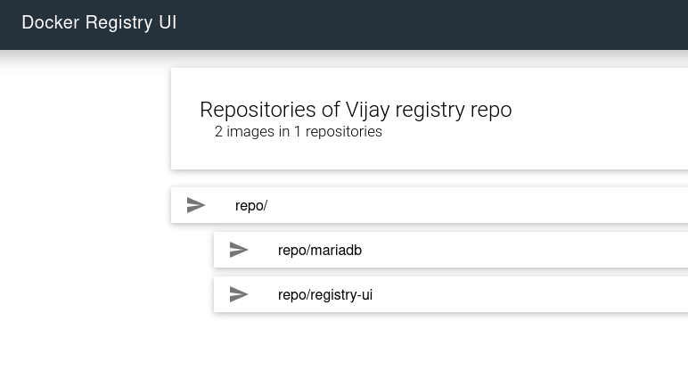

## Setup a self Hosted lab container registry
#### Create a new network and volume
Network needs to create as bridge so that UI and registry can be in same bridge network and reachable to each other. Volume creation is required for registry container as backend so that pushed images would be persistence and you never loose them
```
docker network create registry
docker volume create docvol
```
#### Run the registry container as always on 
```
docker run -d  -v docvol:/var/lib/registry --network=registry --restart=always --name registry registry:2.7
```
#### Now run the registry UI with few custom environment values and by giving proxy url for registry 
```
docker run -d -p 80:80 --restart=always -e REGISTRY_TITLE='My LAB' -e NGINX_PROXY_PASS_URL=http://registry:5000  --network=registry --name registry-ui joxit/docker-registry-ui:latest
```
#### Lets test it !

- Lets test by pulling and image of mariadb
```
docker pull mariadb:10.3
```
- Lets tag it for push
```
docker tag mariadb:10.3 192.168.1.13/repo/mariadb:10.3
```
- Push it 
```
docker push 192.168.1.13/repo/mariadb:10.3
```
#### Now you might need to add your lab registry url as insecure registry in your docker daemon ( because the registry have no ssl certificate)

- Open the file
```
sudo vim /etc/docker/daemon.json
```
- Enter folowing
```
{
  "insecure-registries" : ["192.168.1.13"]
}
```
- Now restart docker daemon

```
sudo systemctl restart docker
```
#### You can access the UI on port 80 

http://192.168.1.13

looks like this -


#### Docker search to registry
```
curl -X GET http://192.168.1.13/v2/_catalog
curl -X GET http://192.168.1.13/v2/mariadb/tags/list
```

Done!
